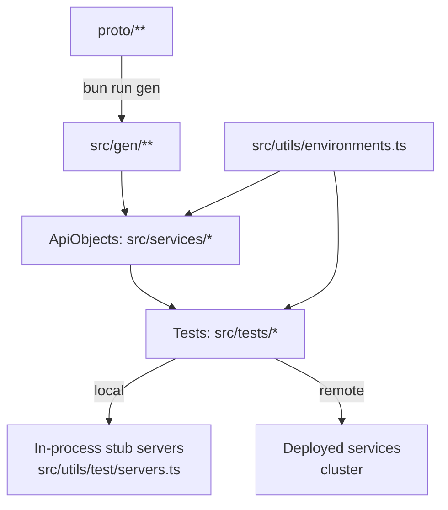
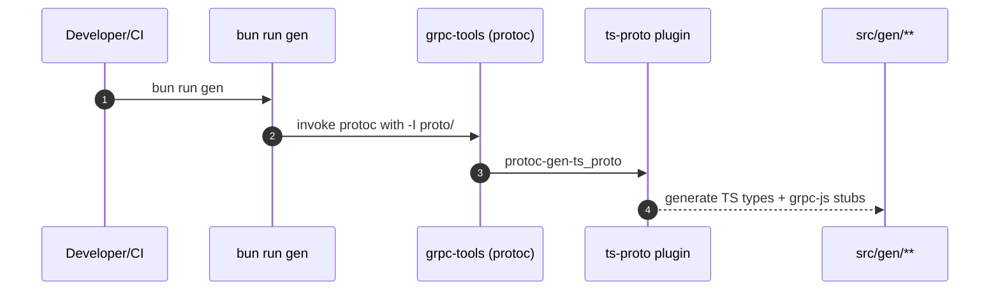
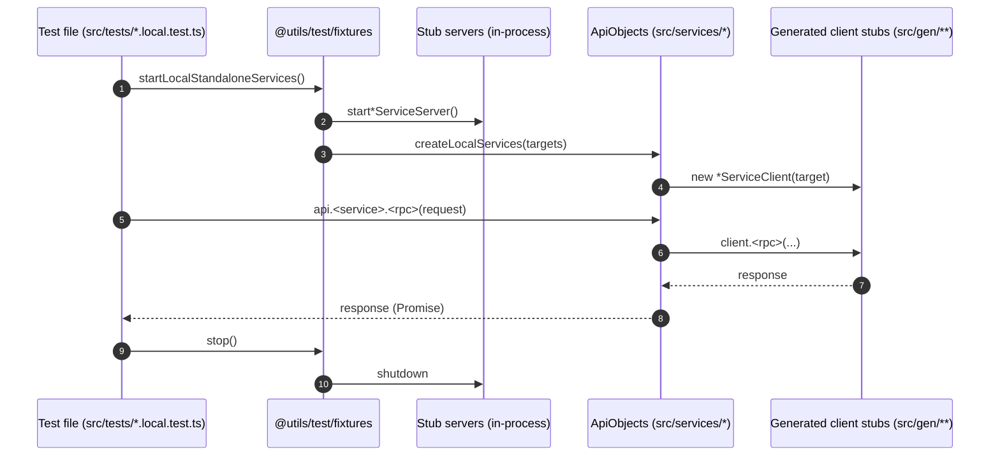

## gRPC test harness (Bun + TypeScript + Vitest)

This folder is a **self-contained gRPC testing framework** you can drop into a large Java (or any) microservices repo to validate **service connectivity + contracts**.

### What you get

- **Proto → TypeScript generation** (commit `src/gen/**`)
- **ApiObjects** (`src/services/*`) that wrap generated gRPC clients (Page Object Model style)
- **Vitest** runner + **JUnit XML** reporting for CI
- **Allure** reporting for humans (search/filter + failure artifacts)
- **TLS/mTLS** credential creation via `@grpc/grpc-js`
- **Global config** (targets + timeouts + retries) in a single file: `src/utils/environments.ts`
- **Global logging** + hard-fail handlers for unhandled errors
- **Path aliases**: `@gen`, `@services`, `@utils`

### Diagrams (high-level)

#### End-to-end flow



---

## Prerequisites

- **Bun** installed
- **Java** installed (required for Allure CLI: `bun run allure:serve`)

---

## Quickstart (new repo / new project)

This is the “copy/paste” path for replicating the harness in a new repository.

### 1) Copy the folder

Copy the whole `grpc-tests/` directory into your target repo.

Keep:

- `package.json`, `tsconfig.json`, `vitest.config.ts`
- `eslint.config.js`, `.prettierrc.json`, `.gitignore`
- `scripts/gen-protos.sh`, `scripts/gen-protos.ps1`
- `src/services/**`, `src/utils/**`
- `SETUP.md` (detailed guide)

Replace:

- `proto/**` with your real proto tree
- delete old generated `src/gen/**` and regenerate (next step)

### 2) Install deps

From `grpc-tests/`:

```bash
bun install
```

### 3) Generate TypeScript from protos

```bash
bun run gen
```

Commit after generation:

- `proto/**`
- `src/gen/**`

### 4) Configure targets + TLS/mTLS

Edit:

- `src/utils/environments.ts`

Select environment at runtime:

- `TEST_ENV=local|dev`

### 5) Run tests + open report

```bash
bun run test
bun run allure:serve
```

If you want a demo failure in the report:

```bash
DEMO_FAIL=1 bun run test
bun run allure:serve
```

---

## Install (existing repo)

From `grpc-tests/`:

```bash
bun install
```

---

## Proto → TypeScript generation

We generate TS using:

- `grpc-tools` (bundled `protoc`, no global install)
- `ts-proto` (`outputServices=grpc-js`) to generate:
  - request/response types
  - `grpc-js` client stubs
  - `grpc-js` server service descriptors (used by local stub servers)

### Generation pipeline (what happens on `bun run gen`)



### Generate (Git Bash / macOS / Linux)

```bash
bun run gen
```

### Generate (PowerShell)

```powershell
bun run gen:ps
```

### What to commit

Commit these whenever protos change:

- `proto/**`
- `src/gen/**` (generated output; do not hand-edit)

---

## Running tests

```bash
bun run test
```

### Allure reporting

Allure results are written to:

- `allure-results/`

Open the report UI:

```bash
bun run allure:serve
```

### JUnit reporting

JUnit XML is written to:

- `test-results/junit.xml`

This is CI-friendly (GitLab/Jenkins/GitHub/etc).

---

## Environments, timeouts, retries (no `.env` required)

All “global variables” live in:

- `src/utils/environments.ts`

Select an environment with:

- `TEST_ENV=local|dev`

### Timeouts

Configured per environment:

- **Per-request (gRPC unary deadline)**: `timeouts.grpcDefaultDeadlineMs`
  - Applied automatically by `BaseGrpcService` unless you override per call.
  - Optional override via env vars: `GRPC_DEFAULT_DEADLINE_MS` or `GRPC_DEADLINE_MS`.
- **Per-test timeout (Vitest)**: `timeouts.testTimeoutMs`
- **Hook timeout (Vitest)**: `timeouts.hookTimeoutMs`
- **Whole run watchdog**: `timeouts.runTimeoutMs`
  - Implemented in `src/utils/test/vitest.setup.ts` (hard-fails if the run hangs too long).

### Retries (Vitest)

Global retries are controlled in `vitest.config.ts`:

- Default: **0 retries locally**
- In CI (when `CI` is set): **2 retries**
- Override explicitly:
  - `VITEST_RETRY=3 bun run test`
  - or `TEST_RETRY=3 bun run test`

---

## Local vs remote testing

### Local tests (demo/offline)

Local tests start **in-process stub servers** (see `src/utils/test/servers.ts`), then create clients via a single fixture.

All tests import **only fixtures**, not random client/server files:

- `@utils/test/fixtures`

Example fixture usage pattern (already used by tests):

- `startLocalStandaloneServices()` → starts all stub servers
- `startLocalUserOrderStackServices()` → includes service-to-service call simulation (Order → User)

### Local test flow (single test file)



### Remote tests (cluster)

Remote tests read targets/certs from **`src/utils/environments.ts`** (selected by `TEST_ENV`), then instantiate ApiObjects using:

- `@utils/fixtures` → `createRemoteServicesFromEnv()`

Remote tests are **skipped automatically** when the relevant service target is missing in the selected environment.

### Remote test flow (cluster)

```mermaid
flowchart LR
  A[Test file] --> B[@utils/fixtures: createRemoteServicesFromEnv]
  B --> C[src/utils/environments.ts<br/>targets + cert paths]
  B --> D[@utils/grpc/credentials.ts<br/>TLS/mTLS creds]
  B --> E[ApiObjects]
  E --> F[Deployed gRPC services]
```

---

## TLS / mTLS

Credentials are created in:

- `src/utils/grpc/credentials.ts`

Remote config comes from:

- `src/utils/environments.ts` (per service)

Use cases:

- **TLS (server-auth only)**: `caCertPath` only
- **mTLS**: `caCertPath` + `clientCertPath` + `clientKeyPath`
- **Insecure (plaintext)**: `insecure: true` (local/dev only)

In CI you typically mount certs (or inject them as files) and point the `*CertPath` values at those paths.

---

## ApiObjects (service wrappers)

All gRPC calls should go through ApiObjects in:

- `src/services/*`

They wrap generated `ts-proto` clients and provide:

- a consistent call style (promise-based unary calls)
- default deadlines (global request timeout)
- a single place to add shared metadata/deadline behaviors

Base class:

- `src/services/base.ts` (`BaseGrpcService`)

---

## Global logging + hard-fail on unhandled errors

- Logger: `src/utils/logger.ts`
  - Set `LOG_LEVEL=debug|info|warn|error|silent`
- Global setup: `src/utils/test/vitest.setup.ts`
  - Installs handlers for:
    - `unhandledRejection`
    - `uncaughtException`
  - Adds a whole-run watchdog from `environments.ts`
  - Makes a global test logger available as `log`

---

## Code quality (ESLint + Prettier)

```bash
bun run lint
bun run format:check
```

Important correctness rule:

- **no floating promises**: gRPC calls must be `await`ed/handled, enforced by ESLint.

---

## Path aliases

Configured in:

- `tsconfig.json` (TypeScript)
- `vitest.config.ts` (runtime for tests)

Aliases:

- `@gen/*` → `src/gen/*`
- `@services/*` → `src/services/*`
- `@utils/*` → `src/utils/*`

---

## Adding a new service (repeatable workflow)

1. Drop protos under `proto/**` (keep folder structure)
2. Generate:

```bash
bun run gen
```

3. Add a new ApiObject in `src/services/<service>.ts` using `BaseGrpcService`
4. Write tests using `@utils/test/fixtures` (local) or `@utils/fixtures` (remote)
5. Commit:
   - `proto/**`
   - `src/gen/**`
