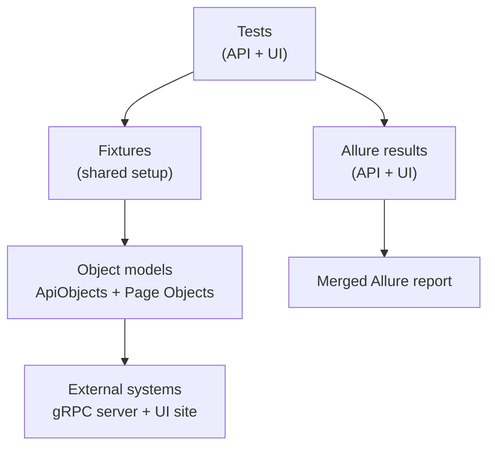
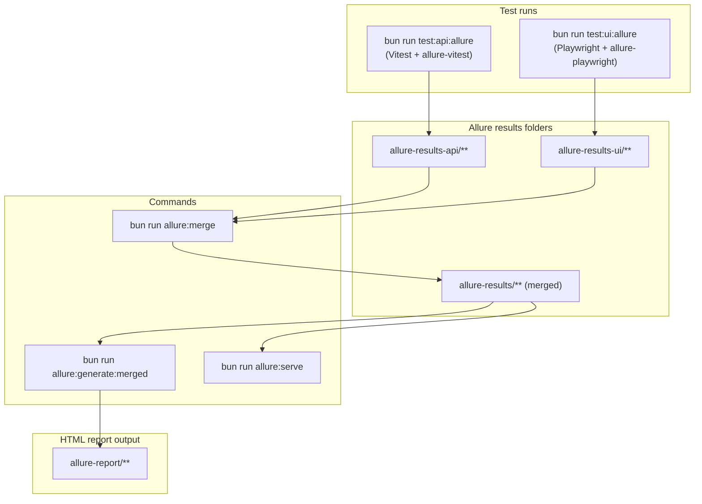
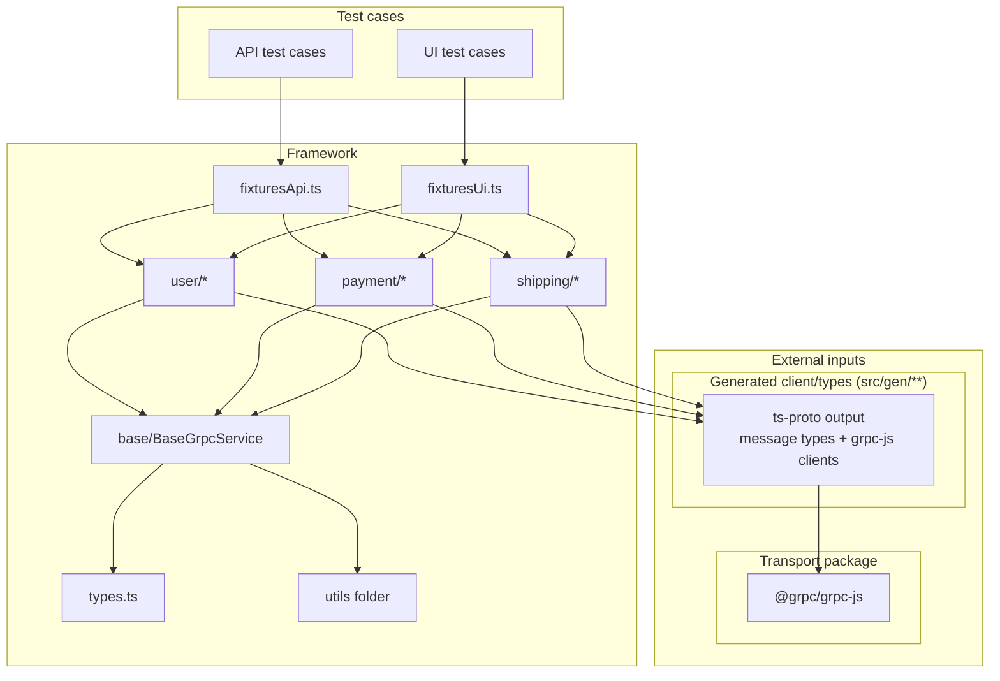
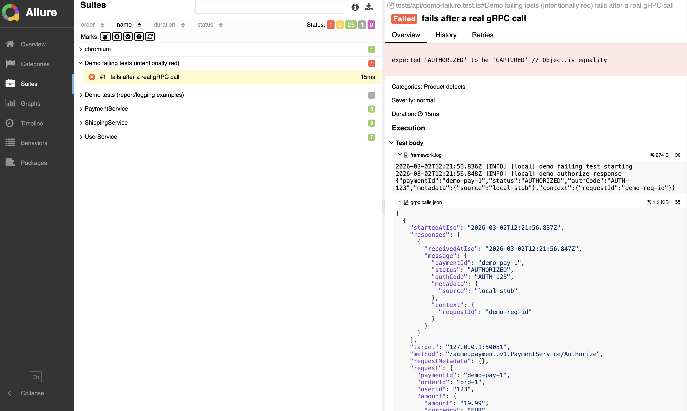

# gRPC Tests Framework (API + UI) walkthrough

Use this file as a **scrollable presentation**.

---

## 1) What is this repo?

This repository is a **small test framework** for validating a gRPC system using:

- **API tests** (Vitest) against an **external stub server** (can also be pointed at real services)
- **UI tests** (Playwright) that can call the same gRPC APIs in the same test
- **Allure reporting** with a **merged report** across API + UI runs

The key idea: **tests stay simple** (Given / When / Then) while the framework owns:

- request building
- success + failure verification
- consistent logging + artifacts
- streaming aggregation (server-stream → “one big response”)

---

## 2) Repo map (what lives where)

- **Protos**: `proto/**`
- **Generated code (committed)**: `src/gen/**`
- **API layer (ApiObjects / Service APIs)**: `src/services/**`
  - base: `src/services/base/**`
  - domains: `src/services/{user,payment,shipping}/**`
- **UI layer (Page Objects)**: `src/pages/**`
- **Utilities**: `src/utils/**`
  - `env.ts` (env parsing, dotenv)
  - `fixturesApi.ts` (API test surface: `api`, `build`, `verify`, `log`)
  - `fixturesUi.ts` (UI test surface: Playwright `test`, plus `api/build/verify/log/pages`)
- **Test server (stub)**: `test-server/**` *(demo purposes)*
- **Tests**
  - API: `tests/api/**`
  - UI: `tests/ui/**`

---

## 3) Main packages used (what they’re for)

I usually show this right after the repo map, so people know what’s “ours” vs “third-party”.

### Runtime dependencies

- **`@grpc/grpc-js`**: Node gRPC runtime (clients/transport).
- **`protobufjs`**: protobuf runtime helpers used by generated code.

### Tooling / test runner dependencies

- **`vitest`**: API test runner.
- **`@playwright/test`**: UI test runner (Chromium).
- **`allure-vitest`** + **`allure-playwright`** + **`allure-commandline`**: results + report generation.
- **`grpc-tools`** + **`ts-proto`**: proto → TypeScript codegen into `src/gen/**`.
- **`typescript`**: typechecking.
- **`eslint`** + **`typescript-eslint`**: linting.
- **`prettier`**: formatting.

### Runtime / package manager

- **`bun`**: installs deps and runs scripts (tests, codegen, tooling).

---

## 4) Connections: insecure vs TLS / mTLS (supported, not demoed)

In this demo repo we run a local stub server on `127.0.0.1:50051`, so the default setup is **insecure plaintext**.

In a real environment, the same service layer can use **TLS or mTLS** by supplying gRPC `ChannelCredentials` to the service APIs:

- **Insecure (demo)**: default when credentials are not provided.
- **TLS / mTLS (real env)**: pass credentials (e.g. `grpc.credentials.createSsl(...)`) into the service constructors.

Why it’s not shown in the demo:

- the stub server is intentionally minimal and runs locally
- certificate provisioning/rotation and trust chains belong to the real deployment environment, not this sample

---

## 5) Architecture (big picture)


---

## 6) Reporting pipeline (Allure): how the report gets built



---

## 7) Connectivity map (main): test cases → framework → external dependencies



---


## 8) The “test style” goal

We aim for a consistent 3-part structure:

- **Given**: build params / input
- **When**: call `api.<service>.<rpc>WithParams(...)`
- **Then**: verify via `verify.<service>.*(...)`

Example shape (conceptual):

```ts
// given
const params = { ... };

// when
const res = await api.user.getUserWithParams(params);

// then
verify.user.getUserSuccess(res, { expectedRequestId: "..." });
```

Why this matters:

- give it a go, even if we are not using strict cucumber at this moment

---

## 9) Why ApiObjects + Page Objects?

Instead of writing raw gRPC calls or raw UI selectors directly in tests:

- We wrap generated gRPC clients in typed **ApiObjects** (`src/services/**`)
- We wrap UI flows in **Page Objects** (`src/pages/**`)

Both follow the same idea: tests should read like a spec and hide low-level details.

ApiObjects typically expose:

- `<rpc>(req)` (typed request)
- `<rpc>WithParams(params)` (request-builder path)

Page Objects typically expose:

- `goto(...)`, `expectLoaded()`, and higher-level user actions for the domain UI

This gives:

- fewer imports in tests
- consistent patterns across API + UI tests
- more useful logs and debugging artifacts when things fail

---

## 10) Streaming: why we aggregate

Server-streaming responses are collected and turned into a **single aggregated response**.

**Why**

- tests can verify *one object* instead of event listeners
- verifiers can reuse the same patterns as unary responses

---

## 11) Failures: promise rejection is the “response”

gRPC “failures” are **rejected promises** (ServiceError), not response objects.

We verify failures through helpers like:

- `verify.<service>.failurePromise(promise, expectedFailure, ctx)`

This:

- standardizes what we log on reject
- keeps failure assertions out of individual tests

---

## 12) Fixtures: the “single import” experience

### API fixture (`src/utils/fixturesApi.ts`)

Exports:

- `api` (ready-to-use clients)
- `log`
- `build` / `request`
- `verify`
- (and re-exports framework helpers)

### UI fixture (`src/utils/fixturesUi.ts`)

Exports:

- Playwright `test`, `expect`
- fixtures: `api`, `log`, `pages`, plus `build/req/verify`

**Important detail**

- UI `api` clients are **closed after each test** (prevents leaked sockets/handles in CI). If this becomes too slow for a real app, we can optimize it.

---

## 13) Allure strategy: API + UI merge

We write separate result folders:

- API → `allure-results-api/`
- UI → `allure-results-ui/`

Then merge into:

- merged → `allure-results/`
- report → `allure-report/`

This supports:

- running API and UI separately
- running them in CI in sequence or in parallel and still producing one report

---

## 14) Commands (local)

### Start stub server (terminal A)

```bash
bun run test-server
```

### Run tests (terminal B)

```bash
# API only
bun run test:api

# UI only
bun run test:ui

# Both (non-strict; continues even if failures)
bun run test

# Strict (CI style)
bun run test:strict
```

### Install Playwright browser (first time)

```bash
bun run test:ui:install
```

---

## 15) Allure (local)

One-command “do everything”:

```bash
bun run allure:local
```

Manual steps:

```bash
bun run allure:clean
(bun run test:api:allure || true)
(bun run test:ui:allure || true)
bun run allure:generate:merged
bun run allure:serve
```

---

## 16) CI overview (what happens on PR)

In `.github/workflows/test.yml` we run **API + UI in parallel**, then build **one merged Allure report**.

### What the pipeline does

- **Discover API test files** dynamically (`tests/api/*.test.ts`)
- **Run API tests** as a matrix (one file per job, parallel) and upload:
  - `allure-results-api/**`
  - `test-results/**` (JUnit)
- **Run UI tests** in parallel and upload:
  - `allure-results-ui/**`
- **Report job** downloads API shards + UI results, then:
  - merges results → `allure-results/**`
  - generates HTML → `allure-report/**`
  - uploads the report artifact
  - posts a PR comment with:
    - a summary table (passed/failed/skipped)
    - links (run page + report artifact)
    - “how to view” instructions

Show:

- the **Actions run page** (you can visibly see API shards + UI running in parallel)
- the **PR comment** (summary table + report artifact link)

---

## 17) Demo screenshot: Allure report (web-only)

- **Top-level summary** (passed / failed / skipped)
- Open one **failing test** and show the attachments:
  - global logs
  - gRPC request, streamed responses, final status/metadata, timing



---

## 18) Design decisions (quick Q&A bullets)

- **Why commit `src/gen/**`?**
  - repeatable builds, less local toolchain pain, easier onboarding
  - this matches common gRPC workflows where code is generated and committed
- **Why external `test-server/`?**
  - test framework stays pure; server process is explicit and debuggable
  - for testing/demo purposes; in a real setup you’d point at a deployed environment
- **Why no `expect` imports in verifiers?**
  - avoids cross-runner collisions; Vitest uses globals, UI uses injected expect
  - meaning: API tests run under Vitest, UI tests run under Playwright, but verifiers can still be shared
- **Why merge Allure results?**
  - single view of “end-to-end”: UI + API in one report
  - usability

---

## 19) Roadmap ideas (optional)

- use this as a skeleton for a real framework
- add one service at a time with API test
- introduce UI tests later
- gradual rolling out

